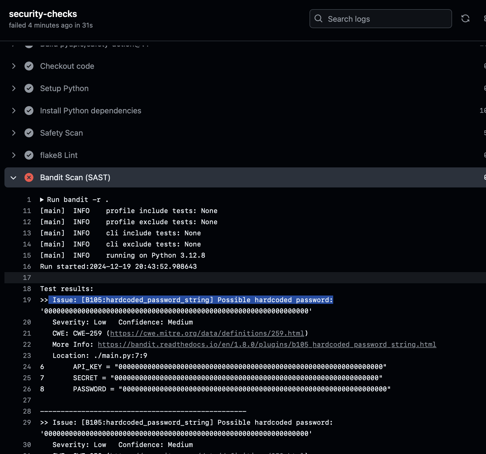
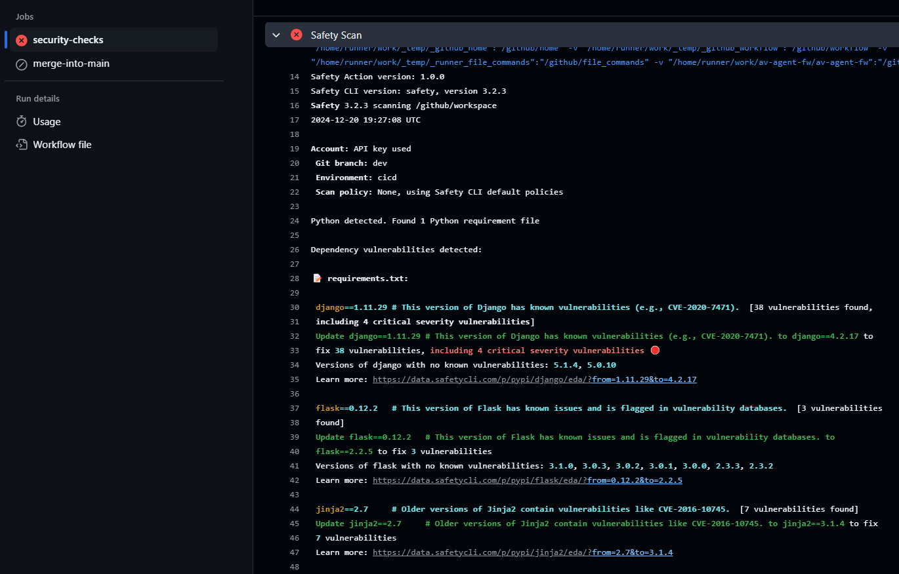
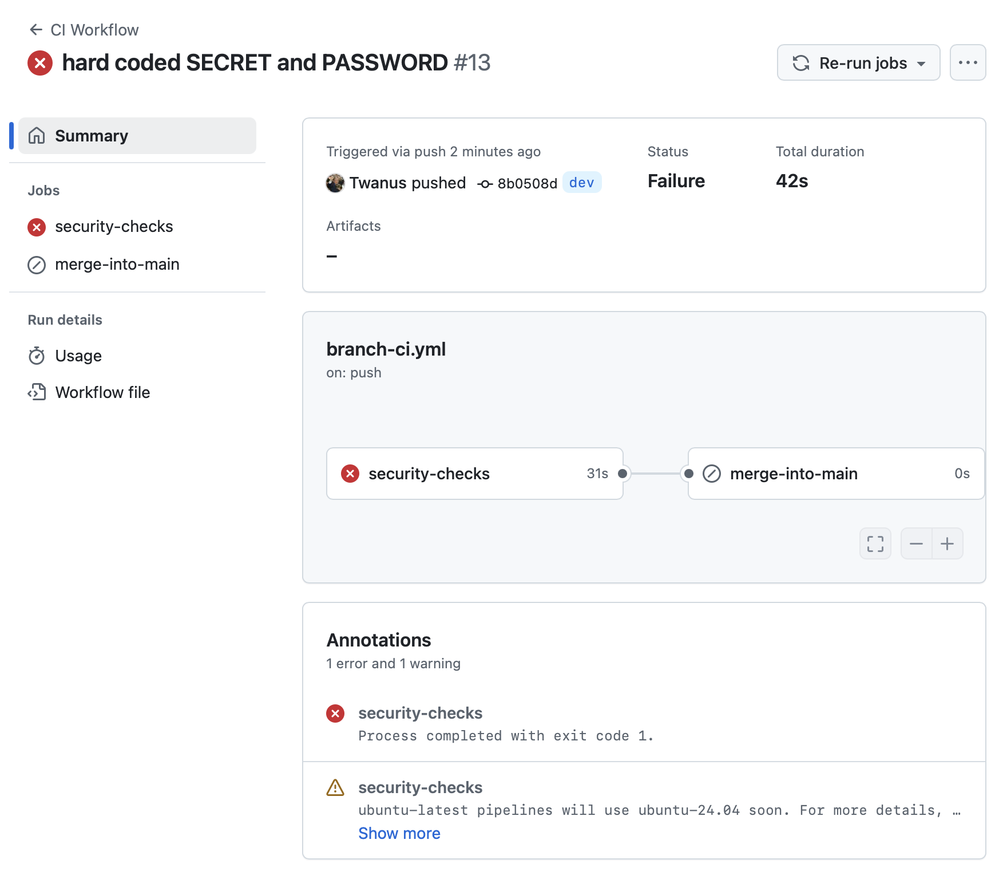

## Verslag: GitHub Integratie en Workflows

### Configuratie van de GitHub Actions

Voor mijn project heb ik een GitHub Actions-workflow geconfigureerd om een Continuous Integration (CI) proces te ondersteunen. De configuratie bestaat uit een workflow genaamd **CI Workflow**, die wordt uitgevoerd bij een **push** naar de `dev`-branch. Dit proces bevat beveiligings- en kwaliteitscontroles, gevolgd door het automatisch samenvoegen van wijzigingen in de `main`-branch indien alle controles succesvol worden afgerond.

Hier is een overzicht van hoe ik de workflow heb ingesteld:

#### 1. **Triggervoorwaarde**

De workflow wordt geactiveerd bij een **push** naar de `dev`-branch:

```yaml
on:
  push:
    branches:
      - dev
```

#### 2. **Beveiligings- en kwaliteitscontroles**

De workflow bevat een reeks jobs onder de naam `security-checks`, die draaien op een Ubuntu-systeem:

- **Safety Scan**: Controleert op kwetsbaarheden in Python-afhankelijkheden met behulp van de Safety-tool.
- **Flake8**: Controleert de code op stijl- en formatteerproblemen.
- **Bandit**: Voert een statische code-analyse uit voor het detecteren van beveiligingsproblemen.
- **TruffleHog**: Zoekt naar geheime sleutels in de code.

#### 3. **Samenvoegen naar de main-branch**

Na succesvolle controles wordt een tweede job uitgevoerd, `merge-into-main`, die de wijzigingen uit de `dev`-branch samenvoegt in de `main`-branch. Deze job is afhankelijk van het slagen van alle controles.

#### 4. **Gebruik van Secrets**

Gevoelige gegevens, zoals API-sleutels, worden beheerd met GitHub Secrets. Bijvoorbeeld:

```yaml
api-key: ${{ secrets.SAFETY_API_TOKEN }}
```

---

### Link naar de GitHub Repository

De configuratie en code van dit project zijn beschikbaar op GitHub: [GitHub Repository Link](https://github.com/Twanus/av-agent-fw)

---

### Workflow Code

Hieronder is de volledige workflow-code:

```yaml
name: CI Workflow

on:
  push:
    branches:
      - dev

permissions:
  contents: write

jobs:
  security-checks:
    runs-on: ubuntu-latest
    permissions:
      contents: read
      security-events: write
    steps:
      - name: Checkout code
        uses: actions/checkout@v3
        with:
          fetch-depth: 0
          submodules: true

      - name: Setup Python
        uses: actions/setup-python@v4
        with:
          python-version: "3.x"

      - name: Install Python dependencies
        run: |
          python -m pip install --upgrade pip
          pip install safety flake8 bandit

      - name: Safety Scan
        uses: pyupio/safety-action@v1
        with:
          api-key: ${{ secrets.SAFETY_API_TOKEN }}

      - name: flake8 Lint
        run: flake8 .

      - name: Bandit Scan (SAST)
        run: bandit -r .

      - name: TruffleHog Secret Scan
        uses: trufflesecurity/trufflehog@main
        with:
          extra_args: --results=verified,unknown --json

  merge-into-main:
    needs: security-checks
    runs-on: ubuntu-latest
    if: success()
    steps:
      - uses: actions/checkout@v3
        with:
          fetch-depth: 0
      - name: Merge dev into main
        run: |
          git config --global user.name 'GitHub Actions'
          git config --global user.email 'actions@github.com'
          git checkout main
          git pull origin main
          git merge --no-ff dev
          git push origin main
        env:
          GITHUB_TOKEN: ${{ secrets.GITHUB_TOKEN }}
```

---

### Screenshot van een Gefaalde Check

Hieronder is een voorbeeld van een screenshot waarin een check faalt en de merge naar master daardoor niet doorgaat:

<h3 style="text-align: center; color: goldenrod;">Figuur 1: Gefaald wegens geheime sleutel</h3>

<br>
<h3 style="text-align: center; color: goldenrod;">Figuur 2: Gefaald wegens kwetsbare packages</h3>

<br>
<h3 style="text-align: center; color: goldenrod;">Figuur 3: Gefaalde 'security-checks' blokkeert 'merge into main' pipeline</h3>

